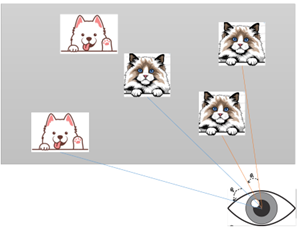
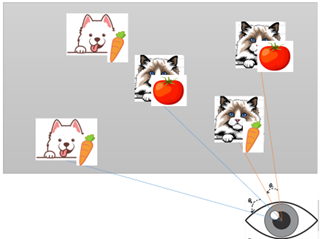

```@meta
EditURL = "About_BacktoBack.jl"
```

````@example About_BacktoBack
using Unfold
using UnfoldMakie, CairoMakie
using UnfoldSim
using UnfoldDecode
using DataFrames
using Statistics
````

# About BacktoBack
## Introduction

“Back-to-Back” regression (B2B) is a linear approach to estimate the decoding performance from a set of correlated factors.

We designed a graphical example to help understand the correlation between variables and the functionality of B2B solver.



## Data generation

#### Simulation and data collection
Collect the data genarated by UnfoldSim, and add certian level of noise

````@example About_BacktoBack
dat, evts = UnfoldSim.predef_eeg(; noiselevel = 0.1, return_epoched = true);
nothing #hide
````

`dat` is a 45 * 2000 matrix consisting of the result of the dependent variable of the simulation

`evts` is a matrix consisting of the data of the independent variables during the simulaiton

#### Renaming

In the first scenario, we have several animal pictures which fall into two categories: 'cat' and 'dog'.Another factor we take into account is the eye angle of the observer.

As the original sets have different namings of the variables, we first need to do some renaming.

We rename the column `condition` to `animal`

````@example About_BacktoBack
evts = rename(evts,:condition => :animal);
nothing #hide
````

Change the value of the column `animal` to "dog" if the value is "car"

````@example About_BacktoBack
evts.animal[evts.animal .== "car"] .= "dog";
nothing #hide
````

Change the value of the column `animal` to "cat" if the value is face"

````@example About_BacktoBack
evts.animal[evts.animal .== "face"] .= "cat";
nothing #hide
````

Rename the column `continuous` to `eye_angle`

````@example About_BacktoBack
evts = rename(evts,:continuous => :eye_angle);
nothing #hide
````

It doesn't change the values nor the essence of the data, only the way we understand it in the real world.

However, as we know, people may have preference on cat and dog, which leads to the possibility that there may be correlation between these two variables. It will be discussed later.

#### Data further generating

Then, we define a new independent variable `vegetable`, which is in the code manually generated by adding a random variable to eye_angle, which means that there is a correlation between the new variable, `vegetable`, and `eye_angle`. We can visualize this correlation in a realistic model: since people will also have a preference for vegetable, the value of eye_angle will be correlated with vegetable.



Therefore, we add a new column `vegetable` generated according to `eye_angle`. It can influence the dependent variable, but is correlated to the independent variable `Category`.

````@example About_BacktoBack
evts.vegetable .= ["tomato","carrot"][1 .+ (evts.eye_angle .+ 10 .* rand(size(evts,1)) .> 7.5)];
nothing #hide
````

And here we also add a new column `continuous_random` with random values, which is independent of the results, in order to be compared by the others.

````@example About_BacktoBack
evts.continuous_random .= rand(size(evts,1));
nothing #hide
````

Now we have the final version of the Dataframe of the independent variable data needed for our model.

#### Dimension expansion
Repeat the dat 20 times, representing 20 channels and therefore we have a new dimension and permute the dimensions for convenience.

````@example About_BacktoBack
dat_3d = permutedims(repeat(dat, 1, 1, 20), [3 1 2]);
nothing #hide
````

Add some noise to each channel to better simulate the result in real world.

````@example About_BacktoBack
dat_3d .+= 0.1*rand(size(dat_3d)...);
nothing #hide
````

Now we have the final version of the dependent variable data needed for our model.

#### Solver selection
Call the solver in UnfoldDecode

Here we've accomplished link to 5 different methods for regression needed in our algorithm: Ridge, Lasso, LS, SVM, and Adaboost(not recomended).

They can be chosen by refering to the parameter `solver_fun` (the default is `model_ridge`)

````@example About_BacktoBack
b2b_solver = (x, y) -> UnfoldDecode.solver_b2b(x, y; cross_val_reps = 5);
# b2b_solver = (x, y) -> UnfoldDecode.solver_b2b(x, y; cross_val_reps = 5, solver_fun = UnfoldDecode.model_lasso);
# b2b_solver = (x, y) -> UnfoldDecode.solver_b2b(x, y; cross_val_reps = 5, solver_fun = UnfoldDecode.model_lsq);
# b2b_solver = (x, y) -> UnfoldDecode.solver_b2b(x, y; cross_val_reps = 5, solver_fun = UnfoldDecode.model_svm);
# b2b_solver = (x, y) -> UnfoldDecode.solver_b2b(x, y; cross_val_reps = 5, solver_fun = UnfoldDecode.model_ada);
````

#### Generate the formula

````@example About_BacktoBack
# We build a dataframe which will contain the 4 graphs generated according to the 4 different formulas (which will be mentioned later)
results_all = DataFrame()
for ix = 1:4
    if ix == 1
        f = @formula 0 ~ 1  + animal + eye_angle
    # The first one takes `animal` and `eye_angle`, which are two independent independent variables that can impact the result into account
    elseif ix == 2
        f = @formula 0 ~ 1  + animal + vegetable
    # The second one takes `animal` and `vegetable`, which are two correlated independent variables in which only one variable really affects the result into account
    elseif ix == 3
        f = @formula 0 ~ 1  + animal + vegetable + eye_angle
    # The third one takes `animal` and `vegetable` and `eye_angle`, which are all variables mentioned above into account
    elseif ix == 4
        f = @formula 0 ~ 1 + animal + eye_angle + continuous_random + vegetable
    # The last one furtherly takes the randomly generated variable `continuous_random` into account
    end
    # By comparing the results of the formulas mentioned above, we can see the effect of BacktoBack algorithm
    # Define a design dictionary according to the formula
    designDict = [Any => (f, range(0, 0.44, step = 1/100))]
    # Fit the model
    m = Unfold.fit(UnfoldModel, designDict, evts, dat_3d; solver = b2b_solver)
    # Present the results in a graph
    results = coeftable(m)
    results.estimate = abs.(results.estimate)
    results = results[results.coefname .!="(Intercept)",:]
    results.formula .= string(f)
    global results_all
    results_all = vcat(results_all,results)
end;
nothing #hide
````

#### Plot the results

````@example About_BacktoBack
plot_erp(results_all; mapping = (; row = :formula), axis = (xlabel = "Time [s]", ylabel = "Performance"))
````

These 4 graphs show how much each independent variable affects the regression results.

The y-axis represents the "Decoding performance" of the regression, and the x-axis represents the time. The different colors represent different independent variables.

In the first diagram, we have only `animal` and `eye_angle`, we can see that they independently affect the results.

In the third diagram, when we have only `animal` and `vegetable`, we can see similar results.

However, as we can see in the forth diagram, when `eye_angle` is introduced on top of the forth diagram, we find that vegetable has less effect on the results.

In the second diagram, we can see that `continuous_random` does have no effect on the results, which is consistent with our expectation.

---

*This page was generated using [Literate.jl](https://github.com/fredrikekre/Literate.jl).*

